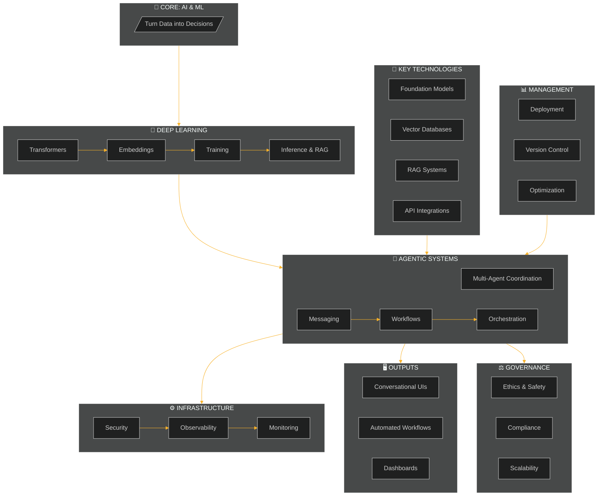

<!-- Header Banner -->
<div align="center">

<!-- Animated Header using Capsule Render -->


<!-- Typing Animation -->


<br/>

</div>


<!-- Quick Stats Badges -->
<p align="center">
  
  
  
  
</p>

<!-- Social/Repo Badges -->
<p align="center">
  <a href="https://github.com/deveshpunjabi/Agentic-AI-Complete-Guide/stargazers">
    
  </a>
  <a href="https://github.com/deveshpunjabi/Agentic-AI-Complete-Guide/network/members">
    
  </a>
  <a href="https://github.com/deveshpunjabi/Agentic-AI-Complete-Guide/issues">
    
  </a>
  <a href="https://github.com/deveshpunjabi/Agentic-AI-Complete-Guide/blob/main/LICENSE">
    
  </a>
</p>

<!-- Decorative Line -->


</div>

<!-- Introduction Section -->
<div align="center">
  <h2>
     
    Welcome to the Ultimate Agentic AI Guide
    
  </h2>
</div>

<p align="center">
  <em>A meticulously crafted roadmap to transform you from a curious beginner into an Agentic AI expert. <br/>
  Every resource is <b>100% free</b> and battle-tested by the community.</em>
</p>

<br/>

<!-- Quick Navigation Cards -->
<div align="center">
  <table>
    <tr>
      <td align="center" width="25%">
        <a href="#-quick-start">
          
          <br/><b>Quick Start</b>
        </a>
      </td>
      <td align="center" width="25%">
        <a href="#-learning-phases">
          
          <br/><b>Roadmap</b>
        </a>
      </td>
      <td align="center" width="25%">
        <a href="#-resource-hub">
          
          <br/><b>Resources</b>
        </a>
      </td>
      <td align="center" width="25%">
        <a href="#-capstone-projects">
          
          <br/><b>Projects</b>
        </a>
      </td>
    </tr>
  </table>
</div>

<br/>

<!-- Animated Divider -->


<br/>

<!-- Table of Contents -->
## 📑 Table of Contents

<details>
<summary>Click to expand navigation</summary>

```
├── 🎯 Overview
│   ├── What is Agentic AI? 
│   └── Why This Guide?
│
├── 🏗️ Framework Architecture
│   ├── System Layers
│   └── Component Breakdown
│
├── 🚀 Quick Start
│   ├── Prerequisites
│   └── Environment Setup
│
├── 📚 Learning Phases
│   ├── Phase 1: AI & ML Foundations
│   ├── Phase 2: Deep Learning & LLMs
│   ├── Phase 3: Agentic Systems
│   ├── Phase 4: Key Technologies
│   ├── Phase 5: Agent Management
│   ├── Phase 6: Outputs & Interfaces
│   └── Phase 7: Governance & Ethics
│
├── 📖 Resource Hub
│   ├── Course Platforms
│   ├── Documentation
│   ├── YouTube Channels
│   └── GitHub Repositories
│
└── 🎨 Capstone Projects
```

</details>

<br/>

<!-- Overview Section -->
## 🎯 Overview

<div align="center">
  
</div>

### What is Agentic AI? 

> **Agentic AI** refers to intelligent systems that can autonomously perceive their environment, reason about complex problems, make decisions, and take actions to achieve specific goals — all with minimal human intervention. 

<br/>

<div align="center">
<table>
<tr>
<td align="center" width="16%">
<br/>
<b>Perception</b><br/>
<sub>Understand inputs</sub>
</td>
<td align="center" width="16%">
<br/>
<b>Reasoning</b><br/>
<sub>Think & plan</sub>
</td>
<td align="center" width="16%">
<br/>
<b>Memory</b><br/>
<sub>Remember context</sub>
</td>
<td align="center" width="16%">
<br/>
<b>Action</b><br/>
<sub>Execute tasks</sub>
</td>
<td align="center" width="16%">
<br/>
<b>Communication</b><br/>
<sub>Multi-agent talk</sub>
</td>
<td align="center" width="16%">
<br/>
<b>Adaptability</b><br/>
<sub>Learn & improve</sub>
</td>
</tr>
</table>
</div>

<br/>

### Why This Guide? 

<table>
<tr>
<td>

**🎓 Structured Learning**
<br/>42-week curriculum from basics to production

**💰 100% Free**
<br/>All resources are freely accessible

**🔄 Always Updated**
<br/>Community-driven and current

</td>
<td>

**🛠️ Hands-On Focus**
<br/>Real projects and practical exercises

**🌐 Comprehensive**
<br/>Covers entire Agentic AI ecosystem

**👥 Community Support**
<br/>Learn alongside others

</td>
</tr>
</table>

<br/>


<br/>

<!-- Framework Architecture -->
## 🏗️ Framework Architecture

<div align="center">
  
</div>

<br/>



<br/>

### 📐 System Layers Breakdown

<div align="center">
<table>
<tr>
<th width="20%">Layer</th>
<th width="30%">Components</th>
<th width="50%">Description</th>
</tr>
<tr>
<td align="center">
<br/>
<b>Core</b>
</td>
<td>AI & ML Fundamentals</td>
<td>Foundation layer that processes data into intelligent decisions using machine learning algorithms</td>
</tr>
<tr>
<td align="center">
<br/>
<b>Neural</b>
</td>
<td>Deep Learning, LLMs, Transformers</td>
<td>Advanced neural architectures including attention mechanisms, embeddings, and large language models</td>
</tr>
<tr>
<td align="center">
<br/>
<b>Agentic</b>
</td>
<td>Multi-Agent Coordination</td>
<td>Orchestration layer managing agent communication, workflows, and collaborative task execution</td>
</tr>
<tr>
<td align="center">
<br/>
<b>Infrastructure</b>
</td>
<td>Security, Observability, Monitoring</td>
<td>Production-grade infrastructure ensuring reliability, security, and performance tracking</td>
</tr>
<tr>
<td align="center">
<br/>
<b>Interface</b>
</td>
<td>UIs, APIs, Dashboards</td>
<td>User-facing layer providing conversational interfaces, automated workflows, and visualizations</td>
</tr>
<tr>
<td align="center">
<br/>
<b>Governance</b>
</td>
<td>Ethics, Compliance, Safety</td>
<td>Regulatory and ethical framework ensuring responsible AI deployment and scalability</td>
</tr>
</table>
</div>

<br/>


<br/>

<!-- Quick Start Section -->
## 🚀 Quick Start

<div align="center">
  

### Prerequisites
  
| Requirement | Details |
|:-----------:|:--------|
|  | Basic programming knowledge (Python preferred) |
|  | Familiarity with command line / terminal |
|  | Computer with stable internet connection |
|  | GitHub account |
|  | Enthusiasm to learn! 🎉 |

</div>

---

<!-- Learning Phases -->
## 📚 Learning Phases

<div align="center">
  
  <br/><br/>
  
  <!-- Progress Overview -->
  
  
  
  
  
  
  
</div>

<br/>

<!-- Phase 1 -->
###  Phase 1: AI & ML Foundations

<table>
<tr>
<td width="70%">

<details open>
<summary><b>📘 Click to expand Phase 1</b></summary>

<br/>

| | Details |
|:--|:--|
| ⏱️ **Duration** | Weeks 1-6 |
| 📊 **Difficulty** | `🟢 Beginner` |
| 🎯 **Goal** | Master ML fundamentals |

#### 📖 What You'll Learn
- ✅ Python programming fundamentals
- ✅ Mathematics for ML (linear algebra, calculus, statistics)
- ✅ Core ML concepts (supervised, unsupervised learning)
- ✅ Data preprocessing and feature engineering

#### 🎓 Free Resources

| Resource | Platform | Link |
|:---------|:---------|:-----|
| MIT 6.S191: Intro to Deep Learning | MIT | [🔗 Visit](https://introtodeeplearning.com/) |
| Andrew Ng's Machine Learning | Coursera | [🔗 Visit](https://www.coursera.org/learn/machine-learning) |
| Kaggle Micro-Courses | Kaggle | [🔗 Visit](https://www.kaggle.com/learn) |
| 3Blue1Brown Neural Networks | YouTube | [🔗 Visit](https://www.youtube.com/playlist?list=PLZHQObOWTQDNU6R1_67000Dx_ZCJB-3pi) |
| Google ML Crash Course | Google | [🔗 Visit](https://developers.google.com/machine-learning/crash-course) |

#### ✅ Milestones
- [ ] Complete Python basics and Pandas
- [ ] Understand linear regression & classification
- [ ] Build first ML model from scratch
- [ ] Complete 2 Kaggle micro-courses

</details>

</td>
<td width="30%" align="center">


**Skills Gained:**
```
Python     ████████░░ 80%
Math       ██████░░░░ 60%
ML Basics  ████████░░ 80%
```

</td>
</tr>
</table>

<br/>

<!-- Phase 2 -->
###  Phase 2: Deep Learning & LLMs

<table>
<tr>
<td width="70%">

<details>
<summary><b>📗 Click to expand Phase 2</b></summary>

<br/>

| | Details |
|: --|:--|
| ⏱️ **Duration** | Weeks 7-14 |
| 📊 **Difficulty** | `🟡 Intermediate` |
| 🎯 **Goal** | Master neural networks & LLMs |

#### 📖 What You'll Learn
- ✅ Neural network architectures (CNNs, RNNs, Transformers)
- ✅ Attention mechanisms and self-attention
- ✅ Large Language Models (training, fine-tuning, inference)
- ✅ Embeddings and vector representations
- ✅ Retrieval-Augmented Generation (RAG)

#### 🎓 Free Resources

| Resource | Platform | Link |
|:---------|:---------|:-----|
| Fast.ai Practical Deep Learning | Fast.ai | [🔗 Visit](https://course.fast.ai/) |
| Neural Networks:  Zero to Hero | YouTube | [🔗 Visit](https://www.youtube.com/playlist?list=PLAqhIrjkxbuWI23v9cThsA9GvCAUhRvKZ) |
| Hugging Face NLP Course | Hugging Face | [🔗 Visit](https://huggingface.co/learn/nlp-course) |
| Deep Learning Specialization | Coursera | [🔗 Visit](https://www.coursera.org/specializations/deep-learning) |
| Cohere LLM University | Cohere | [🔗 Visit](https://cohere.com/llm-university) |
| Dive into Deep Learning | D2L. ai | [🔗 Visit](https://d2l.ai/) |

#### ✅ Milestones
- [ ] Build neural network from scratch (NumPy)
- [ ] Train transformer on custom data
- [ ] Fine-tune pre-trained LLM
- [ ] Implement basic RAG pipeline

</details>

</td>
<td width="30%" align="center">


**Skills Gained:**
```
PyTorch    ████████░░ 80%
Transform.  ██████████ 100%
LLMs       ████████░░ 80%
RAG        ██████░░░░ 60%
```

</td>
</tr>
</table>

<br/>

<!-- Phase 3 -->
###  Phase 3: Agentic Systems & Multi-Agent Coordination

<table>
<tr>
<td width="70%">

<details>
<summary><b>📙 Click to expand Phase 3</b></summary>

<br/>

| | Details |
|: --|:--|
| ⏱️ **Duration** | Weeks 15-22 |
| 📊 **Difficulty** | `🟠 Intermediate-Advanced` |
| 🎯 **Goal** | Build multi-agent systems |

#### 📖 What You'll Learn
- ✅ Agent architectures and design patterns
- ✅ Multi-agent coordination and communication
- ✅ Orchestration frameworks (LangChain, LangGraph, CrewAI, AutoGen)
- ✅ Workflows, messaging, and task delegation
- ✅ Memory systems for agents

#### 🎓 Free Resources

| Resource | Platform | Link |
|:---------|:---------|:-----|
| Hugging Face AI Agents Course | Hugging Face | [🔗 Visit](https://huggingface.co/learn) |
| LangChain & Vector DBs in Production | Activeloop | [🔗 Visit](https://learn.activeloop.ai/courses/langchain) |
| Multi-Agent Systems with CrewAI | DeepLearning.AI | [🔗 Visit](https://www.deeplearning.ai/short-courses/) |
| LangGraph Documentation | LangChain | [🔗 Visit](https://langchain-ai.github.io/langgraph/) |
| CrewAI Official Docs | CrewAI | [🔗 Visit](https://docs.crewai.com/) |
| AutoGen Tutorial | Microsoft | [🔗 Visit](https://github.com/microsoft/autogen) |

#### 🤖 Agent Capabilities Matrix

```
┌────────────────────────────────────────────────────────────┐
│                   AGENT CAPABILITIES                        │
├──────────────┬─────────────────────────────────────────────┤
│ 🔍 Perception │ Understanding inputs (text, images, data)  │
│ 🧠 Reasoning  │ Chain-of-thought, ReAct, Reflexion         │
│ 💾 Memory     │ Short-term, long-term, episodic            │
│ ⚡ Action     │ Tool use, API calls, code execution        │
│ 💬 Communicate│ Inter-agent messaging protocols            │
│ 🔄 Adapt      │ Learning from feedback and environment     │
└──────────────┴─────────────────────────────────────────────┘
```

#### ✅ Milestones
- [ ] Build ReAct agent with LangChain
- [ ] Create multi-agent system with CrewAI
- [ ] Implement agent memory (short & long term)
- [ ] Design workflow with LangGraph

</details>

</td>
<td width="30%" align="center">


**Skills Gained:**
```
LangChain  ██████████ 100%
CrewAI     ████████░░ 80%
AutoGen    ██████░░░░ 60%
Workflows  ████████░░ 80%
```

</td>
</tr>
</table>

<br/>

<!-- Phase 4 -->
###  Phase 4: Key Technologies Deep Dive

<table>
<tr>
<td width="70%">

<details>
<summary><b>📕 Click to expand Phase 4</b></summary>

<br/>

| | Details |
|: --|:--|
| ⏱️ **Duration** | Weeks 23-28 |
| 📊 **Difficulty** | `🔴 Advanced` |
| 🎯 **Goal** | Master supporting technologies |

#### 📖 What You'll Learn
- ✅ Foundation Models (GPT, Claude, Llama, Mistral)
- ✅ Vector Databases (Pinecone, ChromaDB, FAISS, Weaviate)
- ✅ RAG architectures and optimization
- ✅ API integrations and tool use
- ✅ Cloud infrastructure for AI

#### 🎓 Free Resources

| Resource | Platform | Link |
|:---------|:---------|:-----|
| Pinecone Learning Center | Pinecone | [🔗 Visit](https://www.pinecone.io/learn/) |
| ChromaDB Official Docs | ChromaDB | [🔗 Visit](https://docs.trychroma.com/) |
| LangChain RAG Guide | GeeksforGeeks | [🔗 Visit](https://www.geeksforgeeks.org/artificial-intelligence/rag-system-with-langchain-and-langgraph/) |
| OpenAI Cookbook | GitHub | [🔗 Visit](https://github.com/openai/openai-cookbook) |
| AWS Bedrock Tutorials | AWS | [🔗 Visit](https://aws.amazon.com/bedrock/) |

#### 🗄️ Vector Database Comparison

| Database | Best For | Free Tier | Performance |
|:---------|:---------|:----------|:------------|
|  **ChromaDB** | Local dev/prototype | ✅ Open-source | ⭐⭐⭐⭐ |
|  **FAISS** | High-speed local | ✅ Open-source | ⭐⭐⭐⭐⭐ |
|  **Pinecone** | Production RAG | ✅ Free tier | ⭐⭐⭐⭐⭐ |
|  **Weaviate** | Hybrid search | ✅ Open-source | ⭐⭐⭐⭐ |
|  **Qdrant** | Advanced filtering | ✅ Open-source | ⭐⭐⭐⭐ |

#### ✅ Milestones
- [ ] Set up 3 different vector databases
- [ ] Build advanced RAG with reranking
- [ ] Integrate multiple LLM providers
- [ ] Deploy model to cloud infrastructure

</details>

</td>
<td width="30%" align="center">


**Skills Gained:**
```
Vector DBs ██████████ 100%
RAG Adv.    ████████░░ 80%
Cloud      ██████░░░░ 60%
APIs       ████████░░ 80%
```

</td>
</tr>
</table>

<br/>

<!-- Phase 5 -->
###  Phase 5: Agent Management & Infrastructure

<table>
<tr>
<td width="70%">

<details>
<summary><b>📓 Click to expand Phase 5</b></summary>

<br/>

| | Details |
|: --|:--|
| ⏱️ **Duration** | Weeks 29-34 |
| 📊 **Difficulty** | `🔴 Advanced` |
| 🎯 **Goal** | Production-ready deployment |

#### 📖 What You'll Learn
- ✅ Deployment strategies (local, cloud, edge)
- ✅ Monitoring and observability (LangSmith, Phoenix)
- ✅ Version control for AI/ML models
- ✅ Security best practices
- ✅ Performance optimization

#### 🎓 Free Resources

| Resource | Platform | Link |
|:---------|: ---------|:-----|
| Arize Phoenix | Arize AI | [🔗 Visit](https://phoenix.arize.com/) |
| LangSmith | LangChain | [🔗 Visit](https://smith.langchain.com/) |
| Made With ML | Made With ML | [🔗 Visit](https://madewithml.com/) |
| HuggingFace Deployment | Hugging Face | [🔗 Visit](https://huggingface.co/docs/hub/spaces) |
| Docker 101 Tutorial | Docker | [🔗 Visit](https://www.docker.com/101-tutorial/) |
| Kubernetes Tutorials | Kubernetes | [🔗 Visit](https://kubernetes.io/docs/tutorials/) |

#### 📋 Management Checklist

```
✅ DEPLOYMENT                    ✅ MONITORING
├── □ Docker containerization    ├── □ Trace logging
├── □ Kubernetes orchestration   ├── □ Cost tracking
└── □ Serverless (Lambda)        └── □ Latency monitoring

✅ VERSION CONTROL               ✅ SECURITY
├── □ Model versioning (MLflow)  ├── □ API key management
├── □ Prompt versioning          ├── □ Input sanitization
└── □ Config management          └── □ Rate limiting

✅ OPTIMIZATION
├── □ Caching strategies
├── □ Model quantization
└── □ Request batching
```

#### ✅ Milestones
- [ ] Deploy agent with Docker
- [ ] Set up monitoring (LangSmith/Phoenix)
- [ ] Implement model versioning
- [ ] Create CI/CD pipeline for agents

</details>

</td>
<td width="30%" align="center">


**Skills Gained:**
```
Docker     ████████░░ 80%
K8s        ██████░░░░ 60%
MLOps      ████████░░ 80%
Security   ██████░░░░ 60%
```

</td>
</tr>
</table>

<br/>

<!-- Phase 6 -->
###  Phase 6: Outputs & Interfaces

<table>
<tr>
<td width="70%">

<details>
<summary><b>📔 Click to expand Phase 6</b></summary>

<br/>

| | Details |
|: --|:--|
| ⏱️ **Duration** | Weeks 35-38 |
| 📊 **Difficulty** | `🟡 Intermediate` |
| 🎯 **Goal** | Build user-facing interfaces |

#### 📖 What You'll Learn
- ✅ Conversational UIs (Chatbots, Voice assistants)
- ✅ Automated workflows and pipelines
- ✅ Visual dashboards for AI systems
- ✅ API response design
- ✅ Physical actions (robotics integration basics)

#### 🎓 Free Resources

| Resource | Platform | Link |
|:---------|: ---------|:-----|
| Gradio | Gradio | [🔗 Visit](https://gradio.app/) |
| Streamlit Tutorials | Streamlit | [🔗 Visit](https://docs.streamlit.io/) |
| Chainlit | Chainlit | [🔗 Visit](https://docs.chainlit.io/) |
| n8n Workflow Automation | n8n | [🔗 Visit](https://n8n.io/) |
| FastAPI Documentation | FastAPI | [🔗 Visit](https://fastapi.tiangolo.com/) |
| Plotly Dash | Plotly | [🔗 Visit](https://dash.plotly.com/) |

#### ✅ Milestones
- [ ] Build chatbot UI with Gradio
- [ ] Create Streamlit dashboard for agent
- [ ] Design REST API with FastAPI
- [ ] Implement automated workflow with n8n

</details>

</td>
<td width="30%" align="center">


**Skills Gained:**
```
Gradio     ██████████ 100%
Streamlit  ████████░░ 80%
FastAPI    ████████░░ 80%
Dashboards ██████░░░░ 60%
```

</td>
</tr>
</table>

<br/>

<!-- Phase 7 -->
###  Phase 7: Governance & Future

<table>
<tr>
<td width="70%">

<details>
<summary><b>📒 Click to expand Phase 7</b></summary>

<br/>

| | Details |
|: --|:--|
| ⏱️ **Duration** | Weeks 39-42 |
| 📊 **Difficulty** | `🔴 Advanced` |
| 🎯 **Goal** | Responsible AI deployment |

#### 📖 What You'll Learn
- ✅ AI Ethics and responsible AI principles
- ✅ Explainability and interpretability
- ✅ Regulatory compliance (GDPR, HIPAA, EU AI Act)
- ✅ Scalability considerations
- ✅ Future trends and impact assessment

#### 🎓 Free Resources

| Resource | Platform | Link |
|:---------|:---------|:-----|
| Montreal AI Ethics Institute | MAIEI | [🔗 Visit](https://montrealethics.ai/) |
| Microsoft Responsible AI | Microsoft | [🔗 Visit](https://www.microsoft.com/en-us/ai/responsible-ai) |
| EU AI Act Guide | EU | [🔗 Visit](https://digital-strategy.ec.europa.eu/en/policies/regulatory-framework-ai) |
| ICO AI Guidance | ICO | [🔗 Visit](https://ico.org.uk/for-organisations/uk-gdpr-guidance-and-resources/) |
| Interpretable ML Book | Christoph Molnar | [🔗 Visit](https://christophm.github.io/interpretable-ml-book/) |
| Center for AI Safety | CAIS | [🔗 Visit](https://www.safe.ai/) |

#### ⚖️ Compliance Framework

<table>
<tr>
<th>🇪🇺 EU AI Act</th>
<th>🔐 GDPR</th>
<th>🏥 HIPAA</th>
</tr>
<tr>
<td>
• Risk classification<br/>
• Documentation<br/>
• Human oversight<br/>
• Conformity assessment
</td>
<td>
• Lawful basis<br/>
• Privacy by design<br/>
• Data subject rights<br/>
• Impact assessment
</td>
<td>
• PHI protection<br/>
• BAA agreements<br/>
• Audit trails<br/>
• Minimum necessary
</td>
</tr>
</table>

#### ✅ Milestones
- [ ] Complete AI ethics course
- [ ] Implement explainability in agent
- [ ] Create compliance checklist
- [ ] Write AI impact assessment

</details>

</td>
<td width="30%" align="center">


**Skills Gained:**
```
Ethics     ████████░░ 80%
Compliance ██████░░░░ 60%
XAI        ██████░░░░ 60%
Safety     ████████░░ 80%
```

</td>
</tr>
</table>

<br/>


<br/>

<!-- Resource Hub -->
## 📖 Resource Hub

<div align="center">
  
</div>

<br/>

### 🎓 Course Platforms

<div align="center">
<table>
<tr>
<td align="center" width="20%">
<a href="https://www.deeplearning.ai/short-courses/">

<br/><b>DeepLearning.AI</b>
</a>
<br/><sub>Short courses on agents, RAG, LLMs</sub>
</td>
<td align="center" width="20%">
<a href="https://huggingface.co/learn">

<br/><b>Hugging Face</b>
</a>
<br/><sub>NLP, Transformers, AI Agents</sub>
</td>
<td align="center" width="20%">
<a href="https://www.classcentral.com/subject/agentic-systems">

<br/><b>Class Central</b>
</a>
<br/><sub>60+ Agentic AI courses</sub>
</td>
<td align="center" width="20%">
<a href="https://www.analyticsvidhya.com/">

<br/><b>Analytics Vidhya</b>
</a>
<br/><sub>Free AI learning paths</sub>
</td>
<td align="center" width="20%">
<a href="https://www.coursera.org/">

<br/><b>Coursera</b>
</a>
<br/><sub>University courses (audit free)</sub>
</td>
</tr>
</table>
</div>

<br/>

### 📚 Documentation & Tutorials

<div align="center">
<table>
<tr>
<td align="center">
<a href="https://python.langchain.com/">

<br/><b>LangChain Docs</b>
</a>
</td>
<td align="center">
<a href="https://langchain-ai.github.io/langgraph/">

<br/><b>LangGraph</b>
</a>
</td>
<td align="center">
<a href="https://docs.crewai.com/">

<br/><b>CrewAI Docs</b>
</a>
</td>
<td align="center">
<a href="https://microsoft.github.io/autogen/">

<br/><b>AutoGen</b>
</a>
</td>
<td align="center">
<a href="https://cookbook.openai.com/">

<br/><b>OpenAI Cookbook</b>
</a>
</td>
</tr>
</table>
</div>

<br/>

### 📺 YouTube Channels

| Channel | Focus | Subscribers |
|:--------|:------|:------------|
| 🧠 [Andrej Karpathy](https://www.youtube.com/@andrejkarpathy) | Neural networks from scratch | 500K+ |
| 🎨 [3Blue1Brown](https://www.youtube.com/@3blue1brown) | Visual math explanations | 6M+ |
| 📄 [Yannic Kilcher](https://www.youtube.com/@YannicKilcher) | Paper explanations | 250K+ |
| 🤖 [AI Jason](https://www.youtube.com/@AIJason) | LangChain & agents | 100K+ |
| 🗄️ [James Briggs](https://www.youtube.com/@jamesbriggs) | RAG and vector DBs | 200K+ |
| 👥 [Sam Witteveen](https://www.youtube.com/@samwitteveenai) | Multi-agent systems | 50K+ |

<br/>

### 🐙 Essential GitHub Repositories

<div align="center">

| Repository | Description | Stars |
|:-----------|:------------|:------|
| [](https://github.com/langchain-ai/langchain) | LangChain framework |  |
| [](https://github.com/microsoft/autogen) | Multi-agent conversations |  |
| [](https://github.com/crewAIInc/crewAI) | Role-based agent teams |  |
| [](https://github.com/run-llama/llama_index) | LlamaIndex for RAG |  |
| [](https://github.com/openai/openai-cookbook) | OpenAI examples |  |

</div>

<br/>


<br/>

<!-- Timeline Section -->
## 📅 Timeline & Schedule

<div align="center">
  
</div>

<br/>

### 📊 42-Week Visual Timeline

```
PHASE 1 ▓▓▓▓▓▓░░░░░░░░░░░░░░░░░░░░░░░░░░░░░░░░░░░░░░░  Weeks 1-6    │ 🔵 Foundations
PHASE 2 ░░░░░░▓▓▓▓▓▓▓▓░░░░░░░░░░░░░░░░░░░░░░░░░░░░░░░  Weeks 7-14   │ 🟢 Deep Learning
PHASE 3 ░░░░░░░░░░░░░░▓▓▓▓▓▓▓▓░░░░░░░░░░░░░░░░░░░░░░░  Weeks 15-22  │ 🟡 Agentic Systems
PHASE 4 ░░░░░░░░░░░░░░░░░░░░░░▓▓▓▓▓▓░░░░░░░░░░░░░░░░░  Weeks 23-28  │ 🟠 Technologies
PHASE 5 ░░░░░░░░░░░░░░░░░░░░░░░░░░░░▓▓▓▓▓▓░░░░░░░░░░░  Weeks 29-34  │ 🔴 Management
PHASE 6 ░░░░░░░░░░░░░░░░░░░░░░░░░░░░░░░░░░▓▓▓▓░░░░░░░  Weeks 35-38  │ 🟣 Interfaces
PHASE 7 ░░░░░░░░░░░░░░░░░░░░░░░░░░░░░░░░░░░░░░▓▓▓▓░░░  Weeks 39-42  │ ⚫ Governance
```

<br/>

### ⏱️ Commitment Levels

<div align="center">
<table>
<tr>
<th width="25%">🐢 Part-time</th>
<th width="25%">🚶 Standard</th>
<th width="25%">🏃 Intensive</th>
<th width="25%">🚀 Full-time</th>
</tr>
<tr>
<td align="center">
<b>5-10 hrs/week</b><br/>
~12 months
</td>
<td align="center">
<b>10-15 hrs/week</b><br/>
~10 months
</td>
<td align="center">
<b>15-25 hrs/week</b><br/>
~6-8 months
</td>
<td align="center">
<b>40+ hrs/week</b><br/>
~3-4 months
</td>
</tr>
</table>
</div>

<br/>


<br/>

<!-- Capstone Projects -->
## 🎨 Capstone Projects

<div align="center">
  
</div>

<br/>

After completing the roadmap, build one of these projects to demonstrate mastery: 

<div align="center">
<table>
<tr>
<td align="center" width="33%">

<br/><b>🔬 Multi-Agent Research Assistant</b>
<br/><sub>CrewAI agents that research, write, and fact-check</sub>
<br/><br/>

</td>
<td align="center" width="33%">

<br/><b>💬 RAG Customer Support Bot</b>
<br/><sub>Intelligent support with vector DB and memory</sub>
<br/><br/>

</td>
<td align="center" width="33%">

<br/><b>👨‍💻 Autonomous Code Reviewer</b>
<br/><sub>Agent that reviews PRs and suggests improvements</sub>
<br/><br/>

</td>
</tr>
<tr>
<td align="center" width="33%">

<br/><b>📚 Personal AI Tutor</b>
<br/><sub>Adaptive learning agent with progress tracking</sub>
<br/><br/>

</td>
<td align="center" width="33%">

<br/><b>✅ Compliance Auditor Agent</b>
<br/><sub>Scans systems for GDPR/HIPAA compliance</sub>
<br/><br/>

</td>
<td align="center" width="33%">

<br/><b>📰 AI News Aggregator</b>
<br/><sub>Multi-agent news curation and summarization</sub>
<br/><br/>

</td>
</tr>
</table>
</div>

<br/>


<br/>

<!-- Contributing Section -->
## 🤝 Contributing

<div align="center">
  
</div>

<br/>

Contributions are what make the open-source community such an amazing place to learn and grow.  Any contributions you make are **greatly appreciated**. 

<br/>

<div align="center">

| Step | Action |
|: ----:|:-------|
| 1️⃣ | **Fork** the repository |
| 2️⃣ | **Create** your feature branch (`git checkout -b feature/AmazingFeature`) |
| 3️⃣ | **Commit** your changes (`git commit -m 'Add some AmazingFeature'`) |
| 4️⃣ | **Push** to the branch (`git push origin feature/AmazingFeature`) |
| 5️⃣ | **Open** a Pull Request |

</div>

<br/>

### 💡 Contribution Ideas

- 📝 Add new free resources
- 🐛 Fix typos or broken links
- 🌐 Translate to other languages
- 📚 Add code examples
- 🎨 Improve documentation

<br/>


<br/>

<!-- Support Section -->
## ⭐ Support This Project

<div align="center">

If you found this guide helpful, please consider: 

<br/>

<a href="https://github.com/deveshpunjabi/Agentic-AI-Complete-Guide/stargazers">
  
</a>
<a href="https://github.com/deveshpunjabi/Agentic-AI-Complete-Guide/fork">
  
</a>
<a href="https://github.com/deveshpunjabi/Agentic-AI-Complete-Guide/issues/new">
  
</a>

<br/><br/>

**Share with your network:**

[](https://twitter.com/intent/tweet?text=Check%20out%20this%20awesome%20Agentic%20AI%20Complete%20Guide! &url=https://github.com/deveshpunjabi/Agentic-AI-Complete-Guide)
[](https://www.linkedin.com/sharing/share-offsite/?url=https://github.com/deveshpunjabi/Agentic-AI-Complete-Guide)
[](https://reddit.com/submit?url=https://github.com/deveshpunjabi/Agentic-AI-Complete-Guide&title=Agentic%20AI%20Complete%20Guide)

</div>

<br/>


<br/>

<!-- Footer -->
<div align="center">

## 📜 License

This project is licensed under the **MIT License** - see the [LICENSE](LICENSE) file for details. 

<br/>

---

<br/>

### 🙏 Acknowledgments

<sub>
Built with ❤️ by <a href="https://github.com/deveshpunjabi">@deveshpunjabi</a> for the AI community
<br/><br/>
Special thanks to all the educators, content creators, and open-source contributors
<br/>
who make learning Agentic AI accessible to everyone. 
</sub>

<br/><br/>

<a href="#-agentic-ai-complete-learning-roadmap">
  
</a>

<br/><br/>

<!-- Visitor Counter -->


<br/>

<!-- Footer Wave -->


</div>
